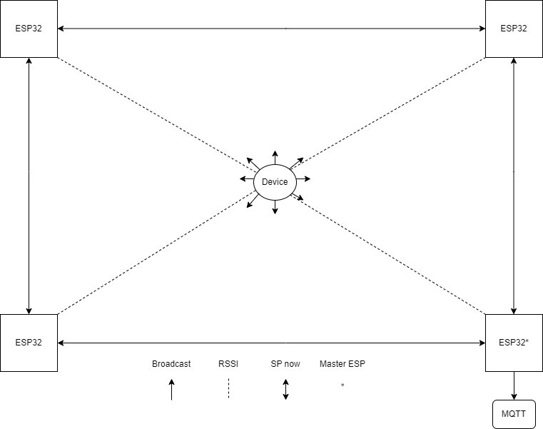

# Portfolio (Søren, Afshin, Michael og Anders)

## Hvordan ser løsningen ud
- [ ] Arkitektur

#### Role Manager
Den nemme løsning ville være at hardcode en specifik ESP-enheds MAC-adresse, som så ville modtage pakker fra de andre ESP-enheder. Det ville være det simpleste, men den optimale løsning er, at den centrale ESP-enhed vælges dynamisk gennem en form for lodtrækning.

Når projektet starter op, genererer hver enhed et tilfældigt ID-nummer mellem 1 og 1.000.000. Enhederne begynder derefter at broadcaste deres ID’er til de øvrige tilstedeværende enheder, samtidig med at de modtager ID’er fra de andre.

I tilfælde af en kollision *(to eller flere enheder har samme ID)*, genererer de pågældende enheder et nyt ID, indtil alle ID’er er unikke.

Når alle ID’er er unikke, sammenlignes de, og den enhed med det laveste ID tildeles rollen som **central enhed**.

- [ ] Teknologier
  - Mindst 4 ESP32 enheder
  - Visual Studio Code
  - PlatformIO (VS Code Extension)
  - DrawIO (VS Code Extension)
  - MQTT Server
  - Docker Server

## Dataprocess
- [ ] primær dataopsamling  
- [ ] data berigelse
- [ ] beregning
- [ ] data lagring
Umiddelbart lagrer det nuværende projekt ikke data i længere tid af gangen, men sletter det efter afsendelse til den centrale MQTT-server. Det er dog muligt både at gemme data i kortere tid i hukommelsen og gennem længere tid på det oprettede LittleFS drev.
- [ ] evt data visualisering
Vores Esp32 er sat op til, at kunne vise indsamlet data på en dertil oprettet wifi-server og chart.js. Der har dog desværre ikke været tid til at færdiggøre denne del af projektet. Data ville kunne sendes (og downloades) som csv-fil, men også i realtime via en socket.

## Datasikkerhed

### Følsomhed
  - [ ] hvad er personlige data?
  Personoplysninger er sikret gennem Databeskyttelsesfordordningen GDPR. Personoplysninger kan omhandle enten __identificerede__ eller __identificerbare__ personer. Der skelnes ligeledes mellem almindelige personoplysninger og følsomme personoplysninger.

  Almindelige oplysninger er navn, mail, telefonummer, adresse mm., altså oplysninger, der som oftest indgår i f.eks. nethandel. Der er således ikke de samme begrænsninger på brugen og opbevaringen af oplysninger anerkendt som almindelige.

  Følsomme oplysninger omhandler race, religion, politisk overbevisning, helbredsoplysninger, juridiske oplysninger og lignende. Der kræves udtrykkeligt samtykke fra en person, for lovligt at behandle denne data.
  
  En nærmere gennemgang kan findes [her](https://gdpr.dk/persondataforordningen/hvad-er-personoplysninger/).

  - [ ] hvad er risikoen ved at behandle andre folks personlige data?

  Den dataansvarlige skal allerede før behandling af personfølsomme data, have forstået risikoen over for de "registreredes" rettigheder, og så have en afvejning af disse risici i forhold til de forholdsregler, der bliver truffet for at beskytte disse rettigheder. 

  Nogle af de vigtigeste risici er: 

  **Privatlivsbrud**

    - Data kan medføre til identitetstyveri eller misbrug af personlige oplysninger

  **Juridiske konsekvenser**

    - GDPR kræver at at personfølsomme data behandles korrekt. Brud kan medføre store bøder.
  
  **Tab af tillid**

    - Uansvarligt håndtering af data, kan skade organisationers ry og relationer med kunder og medarbejder.
  
  **Cyberangreb**

    - Dårlig sikkerhed kan føre til hackerangreb, hvor data bliver stjålet eller lækket. 

  - [ ] i hvor høj grad er de data projektet benytter personlige?
  
  Det kan diskuteres, i hvor høj grad det data, som benyttes i nærværende projekt, er beskyttet under GDPR. Der er hovedsageligt tale om MAC-adresser og positionsdata. 
  
  MAC-adresser er unikke til hver enhed, og det er derfor i teorien muligt at identificere enhedens ejer ud fra adressen. 
  
  Dog gemmes MAC-adresser allerede sammen med enhedens IP-adresse på alle netværksenheder i den såkaldte arp-tabel til brug for kommunikation over netværket. Der kan derfor argumenteres for, at informationen allerede er tilgængelig, hvis det ønskes. Samtidig er de nemme at skifte til trods for deres forbindelse til enheden - mange moderne enheder ændrer faktisk deres MAC-adresse automatisk, hver gang de forbinder til et netværk.
  
  MAC-adresser ligger således i et gråzonefelt, når det kommer til persondataoplysninger.

  Enhedes position, eller lokaliseringsdata, falder under _identificerbare_ personoplysninger. Når der i projektet trianguleres en position for en bestemt enhed, vil der derfor være tale om data beskyttet under GDPR. Da positionsdata anvendes af mange forskellige leverandører, ligger det i kategorien almindelige personoplysninger.

  Projektet tager højde for udfordringerne ved behandling af data gennem anonymisering og kryptering, samt ved at slette data så snart, det kan lade sig gøre. 

  - [ ] er data mere personlige når de beriges?

  Dette kan variere alt efter oplysningernes karakter, men overordnet set kan man sige, at jo flere oplysninger, der kan knyttes til data, jo nærmere kan man komme på at identificere en person.

  - [ ] hvor længe er der brug for at have personlige data i projektet?

  Projektet har behov for de mulige identificerbare oplysninger i meget kort tid. Så snart en opsamlet datablok er afsendt til den centrale MQTT-server, glemmes alle oplysninger om MAC-adresser. Det afsendte data vil være anonymiseret.

### Beskyttelse
  - [ ] hvem kan få adgang?

  Dem der har adgang til personfølsomme oplysninger er, dem, hvis oplysningerne tilhøre og handler om. 

  Så hvis en person, hvis data man behandler, bliver bedt om at få adgang til deres oplysninger, så skal vedkommende have adgang. 

  - [ ] hvor svært er det for udenforstående at skaffe sig adgang til data?

  Som sagt før, hvis vedkommende beder om oplysninger der handler og tilhøre dem, så skal de have adgang til dem. Det bliver dog noget vanskeligt, da de fleste vil anmode om adgang via telefonopkald eller via email. 
  
  Her kan man ikke verificere vedkommendes identitet og i værste tilfælde kan man give adgang til følsomme oplysninger til en anden. Hackere bliver endnu bedre til at efterligne andre mennesker.

  - [ ] eller at lytte med?
